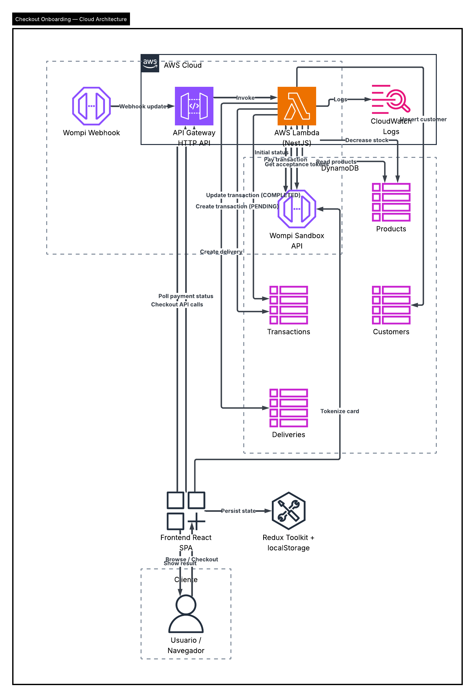

# Checkout Onboarding

Aplicacion full stack para un flujo de checkout onboarding de un producto con pago con tarjeta usando Wompi Sandbox.

## Stack

- Frontend: React 19 + Redux Toolkit + Vite
- Backend: NestJS 11 + TypeScript
- Persistencia: DynamoDB
- Infraestructura: AWS Lambda + API Gateway + Serverless Framework
- Pruebas: Jest en frontend y backend

## Modulos principales

- Catalogo de productos
- Pagos y tokens de aceptacion de Wompi
- Transacciones
- Customers
- Deliveries

## Flujo funcional implementado

1. El usuario ve una lista de productos disponibles.
2. Selecciona un producto y arranca el checkout.
3. Diligencia tarjeta, datos del cliente y direccion de entrega.
4. Acepta terminos y autorizaciones exigidas por Wompi.
5. Revisa el resumen con producto, base fee y delivery fee cargados desde backend.
6. El frontend tokeniza la tarjeta y el backend crea la transaccion local.
7. El backend procesa el pago en Wompi Sandbox.
8. Se muestra el estado final del pago.
9. Si el pago fue aprobado, el stock baja y el catalogo se refresca.

## Diagrama de arquitectura



Documentacion relacionada:

- [Arquitectura](./docs/03-arquitectura.md)
- [Prompt para diagrama](./docs/06-prompt-diagrama-lucidchart.md)

## Cobertura

### Frontend

- Statements: 97.29%
- Branches: 84.61%
- Functions: 93.02%
- Lines: 97.09%

### Backend

- Statements: 100%
- Branches: 92.36%
- Functions: 100%
- Lines: 100%

## Documentacion

- [Casos de uso](./docs/01-casos-de-uso.md)
- [Documentacion tecnica](./docs/02-documentacion-tecnica.md)
- [Arquitectura](./docs/03-arquitectura.md)
- [Documentacion del proyecto](./docs/04-documentacion-del-proyecto.md)
- [Guia de pruebas](./docs/05-guia-de-pruebas.md)
- [Prompt para diagrama](./docs/06-prompt-diagrama-lucidchart.md)

## Variables de entorno

### Frontend

Ver [frontend/.env.example](./frontend/.env.example)

- `VITE_API_BASE_URL`
- `VITE_WOMPI_BASE_URL`
- `VITE_WOMPI_PUBLIC_KEY`

### Backend

Ver [backend/.env.example](./backend/.env.example)

- `PORT`
- `AWS_REGION`
- `USE_DYNAMODB`
- `DYNAMODB_TABLE_PRODUCTS`
- `DYNAMODB_TABLE_TRANSACTIONS`
- `DYNAMODB_TABLE_CUSTOMERS`
- `DYNAMODB_TABLE_DELIVERIES`
- `WOMPI_BASE_URL`
- `WOMPI_PUBLIC_KEY`
- `WOMPI_PRIVATE_KEY`
- `WOMPI_INTEGRITY_SECRET`
- `WOMPI_EVENTS_SECRET`
- `CHECKOUT_BASE_FEE_IN_CENTS`
- `CHECKOUT_DELIVERY_FEE_IN_CENTS`

## Imagenes de productos

Las imagenes del catalogo se leen desde:

- [frontend/public/product-images](./frontend/public/product-images)

Puedes agregar archivos con el nombre exacto del producto, por ejemplo:

- `PlayStation 5.png`
- `PlayStation 4.jpg`

El frontend intenta cargar automaticamente extensiones `png`, `jpg`, `jpeg` y `webp`.

## Comandos utiles

### Raiz

```bash
npm install
npm run build
npm run lint
```

### Frontend

```bash
cd frontend
npm run dev
npm run lint
npm run test:cov
```

### Backend

```bash
cd backend
npm run start:dev
npm run lint
npm run test:cov -- --runInBand
npm run seed:products -- --replace-existing --table-name checkout-onboarding-api-dev-products --region us-east-1
npm run deploy
```

## Postman

La coleccion y environments estan en [postman](./postman).

## Nota

El backend ya esta preparado para despliegue serverless. Si haces cambios en infraestructura o codigo backend, vuelve a desplegar con `cd backend && npm run deploy`.
