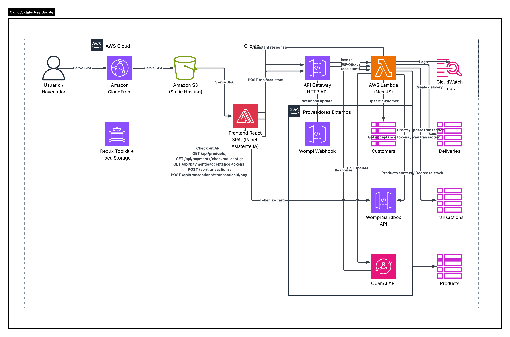

# Documentacion de arquitectura

[Volver al indice principal](../README.md)

## Estilo arquitectonico

La solucion usa un monolito modular serverless:

- frontend SPA desacoplado
- backend HTTP unico sobre NestJS
- persistencia DynamoDB
- pagos integrados con Wompi Sandbox

## Diagrama de arquitectura



## Diagrama de flujo


## Componentes

### Frontend

- React
- Redux Toolkit
- `localStorage` para persistencia del flujo
- cliente HTTP para backend
- cliente HTTP para tokenizacion contra Wompi

### Backend

- Lambda Node.js 20
- API Gateway HTTP API
- NestJS como adaptador HTTP unico
- modulo de pagos con gateway de Wompi
- modulos de `catalog`, `transactions`, `customers`, `deliveries`

### Persistencia

- DynamoDB `Products`
- DynamoDB `Transactions`
- DynamoDB `Customers`
- DynamoDB `Deliveries`

### Infraestructura AWS

- AWS Lambda
- API Gateway HTTP API
- DynamoDB
- CloudWatch Logs
- Serverless Framework

### Seguridad

- HTTPS en frontend por CloudFront
- HTTPS en backend por API Gateway
- validación global de requests con `ValidationPipe`
- headers de seguridad HTTP en backend usando `helmet`
- CORS controlado en la configuración global de Nest

## Flujo de alto nivel

```text
React SPA
  -> API Gateway
    -> Lambda (NestJS)
      -> DynamoDB
      -> Wompi Sandbox
```

## Flujo de pago

```text
1. Frontend consulta productos
2. Usuario selecciona producto
3. Frontend consulta acceptance tokens
4. Frontend tokeniza la tarjeta con Wompi
5. Frontend crea la transaccion local en backend
6. Backend crea el pago en Wompi
7. Backend sincroniza estado
8. Si APPROVED:
   - crea/reutiliza customer
   - crea delivery
   - descuenta stock
9. Frontend muestra estado final
10. Frontend vuelve al catalogo y refresca stock
```

## Decisiones importantes

### Persistencia del avance

Se resolvio con `Redux + localStorage` en frontend. Se elimino `checkout session` porque ya no aportaba al flujo real.

### Integracion con Wompi

- Frontend usa `public key`
- Backend usa `private key`
- Webhook usa `events secret`
- Firma usa `integrity secret`

### Manejo de estados

#### PaymentStatus

- `PENDING`
- `APPROVED`
- `DECLINED`
- `VOIDED`
- `ERROR`

#### FulfillmentStatus

- `NOT_STARTED`
- `COMPLETED`
- `FAILED`

## Despliegue backend

La infraestructura del backend esta definida en:

- [serverless.yml](../backend/serverless.yml)

Configuracion principal:

- runtime `nodejs20.x`
- una sola Lambda HTTP
- tablas Dynamo por modulo
- CORS habilitado

## Ventajas de esta arquitectura

- sencilla de explicar y operar
- cumple el reto sin sobre-ingenieria
- desacopla frontend, backend y proveedor de pago
- permite pruebas unitarias por modulo
- soporta stock y fulfillment reales

---

[Volver al indice principal](../README.md)
