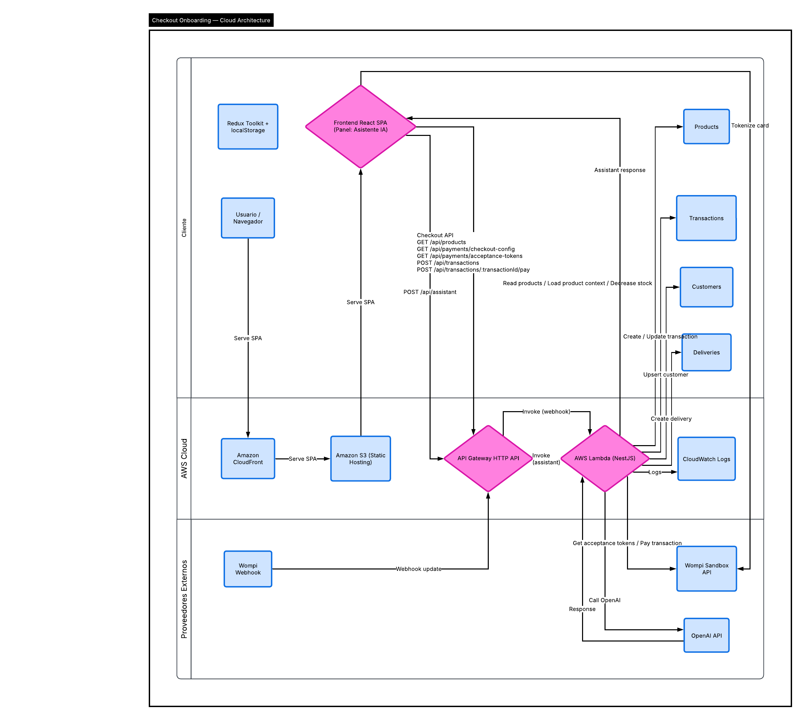

# Guia de pruebas

[Volver al indice principal](../README.md)

## Flujo visual de referencia



## 1. Preparacion local

### Instalar dependencias

```bash
npm install
```

### Variables de entorno

#### Frontend

Crea `frontend/.env` con base en:

- [frontend/.env.example](../frontend/.env.example)

#### Backend

Crea `backend/.env` con base en:

- [backend/.env.example](../backend/.env.example)

## 2. Ejecutar backend local

```bash
cd backend
npm run start:dev
```

## 3. Ejecutar frontend local

```bash
cd frontend
npm run dev
```

## 4. Probar por UI

### Caso aprobado

1. Abre la app.
2. Selecciona un producto.
3. Llena el modal.
4. Usa tarjeta `4242 4242 4242 4242`.
5. Usa fecha futura y CVC `123`.
6. Acepta terminos.
7. Continua al resumen.
8. Presiona `Pagar con tarjeta`.
9. Verifica pantalla de exito.
10. Presiona `Volver al catalogo`.
11. Verifica que el stock bajo en `1`.

### Caso rechazado

1. Repite el flujo.
2. Usa tarjeta `4111 1111 1111 1111`.
3. Usa fecha futura y CVC `123`.
4. Continua al resumen.
5. Paga.
6. Verifica pantalla de rechazo.
7. Verifica que el stock no cambia.

## 5. Probar por Postman

Usa:

- [checkout-onboarding.postman_collection.json](../postman/checkout-onboarding.postman_collection.json)
- [checkout-onboarding.local.postman_environment.json](../postman/checkout-onboarding.local.postman_environment.json)
- [checkout-onboarding.aws-dev.postman_environment.json](../postman/checkout-onboarding.aws-dev.postman_environment.json)
- [Endpoints y contratos](./07-endpoints-y-contratos.md)

### Orden recomendado

1. `Health`
2. `List Products`
3. `Get Checkout Config`
4. `Get Acceptance Tokens`
5. `Create Transaction`
6. `Get Transaction`
7. `Process Transaction Payment`
8. `Get Transaction`
9. `Simulate Wompi Webhook` si quieres probar el webhook manualmente

## 6. Ejecutar pruebas automaticas

### Frontend

```bash
cd frontend
npm run lint
npm run test -- --runInBand
npm run test:cov
```

### Backend

```bash
cd backend
npm run lint
npm run build
npm run test -- --runInBand
npm run test:cov -- --runInBand
```

## 7. Seed de productos

Para sembrar la tabla Dynamo de productos:

```bash
cd backend
npm run seed:products -- --replace-existing --table-name checkout-onboarding-api-dev-products --region us-east-1
```

## 8. Despliegue backend

```bash
cd backend
npm run deploy
```

Despues, revisa:

```bash
npx serverless info
```

## 9. Smoke test de backend desplegado

Prueba:

- `GET /api/health`
- `GET /api/products`
- `GET /api/payments/checkout-config`
- `GET /api/payments/acceptance-tokens`

Si quieres validar rápidamente los headers de seguridad:

- revisa en navegador o Postman respuestas como `GET /api/health`
- confirma presencia de headers como `x-dns-prefetch-control`, `x-frame-options`, `x-content-type-options` y `referrer-policy`

## 10. Checklist final

- frontend carga productos reales
- pagos aprobados descuentan stock
- pagos rechazados no descuentan stock
- tests frontend > 80%
- tests backend > 80%
- Postman importable
- variables de entorno documentadas
- headers de seguridad visibles en la API desplegada

---

[Volver al indice principal](../README.md)
